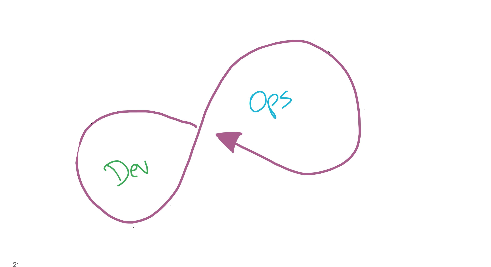
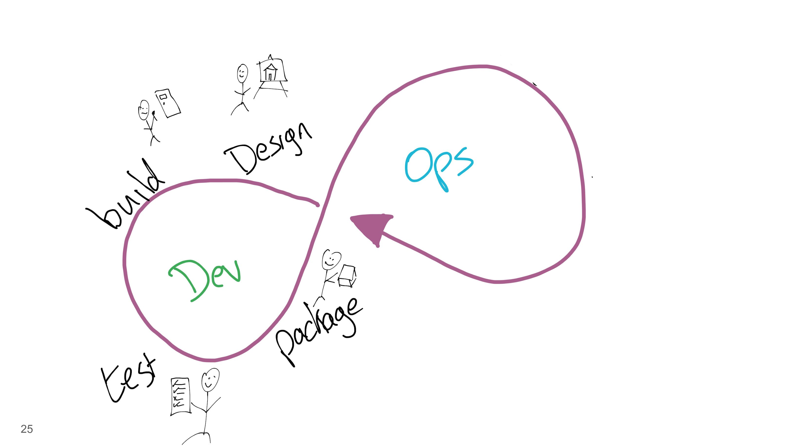

# DevOps
## The Red Hat Way

Dmytri Kleiner 
Senior Architect, Red Hat Open Innovation Labs
dk@redhat.com 
@dmytri

---

# Red Hat Makes
# Linux

---

# Containers are
# Linux

---

### Adopting 
# Containers
## Is A Lot Different
### Than Adopting Linux

---

### Moving from Windows Or Unix
# To Linux
### Is a Technological Change

---

#### Moving from Servers To Containers Is A 
# Cultural Change

---

#### Agile
### Microservices
# DevOps
#### Design Thinking 
##### Cross Functional Teams
# CI/CD
### Quick Feedback Loops

---

# Continuous Everything As Code

---

##### Customers Asked us to Help them
### Make The Cultural Change
##### As they where adopting new technologies

---

# Open
# Is Agile
> Each project is a cross functional team with a delivery pipeline from upstream to subscribers, with direct community contact with users

##### Agile is in our DNA

---

## So, About
# DevOps

---

> Before DevOps

---

> Tear Down That Wall

---

> Build the DevOps loop

---

*Drawings from Mike Hepburn*

Buy his book

---

> Build the DevOps loop

---

> Discovery and Design Practices

---

> Agile, Pair Programming, TDD, etc

---

> Public Service Announcement

### Move Away From
# Stone Age IT
#### Let Developers Develop on their own machines, with their own tools
### Medieval Perimeter Security Does Not Replace Good Security Practices

---

> Agile, Pair Programming, TDD, etc

---

> Automated Testing, TDD

---

> Package, Containerize

---

> CI/CD&nbsp;&nbsp;&nbsp;

---

> CI/CD2

---

> Continuous Integration

Dev > Unit Tests > ***Integration Tests***

> Continuous Delivery

Dev > Unit Tests > Integration Tests > ***Acceptance Tests***

> Continuous Deployment

Dev > Unit Tests > Integration Tests > Acceptance Tests > ***Production***

---

> CI/CD2

---

> Wait, what? Operate?

---

***the old skool way***
### Devs
> <pre style="text-align:center">
Applications
</pre>

### Ops
> <pre style="text-align:center">
&nbsp;Dependencies&nbsp;

OS

Infrastructure
</pre>

---
***the old skool way***
### Devs
> <pre style="text-align:center">
Applications
</pre>

### Ops
> <pre style="text-align:center">
&nbsp;Dependencies?

OS

Infrastructure
</pre>

---

***the old skool way***
### Devs
> <pre style="text-align:center">
Applications

&nbsp;Dependencies?
</pre>

### Ops
> <pre style="text-align:center">
OS

Infrastructure
</pre>

---

### Devs
> <pre style="text-align:center">
Applications

App Dependencies?
</pre>

### Ops
> <pre style="text-align:center">
OS Dependencies?

OS

Infrastructure
</pre>

---

### Devs
> <pre style="text-align:center">
Applications

App Dependencies?
</pre>

### Ops
> <pre style="text-align:center">
Middleware?

OS

Infrastructure
</pre>

---

> I dunno, just toss it over the wall.

---

***the DevOps way***
### Delivery Teams
> <pre style="text-align:center">
Applications

Container
</pre>

### IT / Public Cloud
> <pre style="text-align:center">
Container Host

Infrastructure
</pre>

---

> You built it, you run it! 

---

> Monitor to make sure it's all running

---

> And all they lived happily ever after

---

> And all they lived happily ever after

---

## HAHA HAHAHA
#### HAHA HAHAHA
# HAHA HAHAHA
### HAHA HAHAHA
#### HAHA HAHAHA
### HAHA HAHAHA

---

#### HAHA HAHAHA
## HAHA HAHAHA
### HAHA HAHAHA
# HAHAHA HAHA
### HAHA HAHAHA
#### HAHA HAHAHA

---

# All that's the easy part

---

## Cross Functional Teams are awesome
### But cross functional means more than front end, back end and ops working together

---

> Cross Functional Means
##### Security
# UX
### Business

### *Everything, all the way from your user to your bank account*

---

> BizDevSecDesOps... ...

And Marketing, Sales, Customer Success, and Support should be up in there to

---

## Teams need to be autonomous
### They need to be able to decide what to do, and have the authority do it

---

# What stands in the way is not technical

---

## The
# Problem 
## *is Management*

---

> And with that, we'll take a small break to watch a video about a submarine

---

<iframe width="560" height="315" src="https://www.youtube.com/embed/OqmdLcyES_Q" frameborder="0" allow="accelerometer; autoplay; encrypted-media; gyroscope; picture-in-picture" allowfullscreen></iframe>

---

#### Management:
### Don't Give Instructions
# Give Intent

---

## Move Authority Down To Information

---

#### A cross functional team must include
# empowered leaders
> Otherwise, all the Dev, and all the Ops, and all the UX and the  Microservices, and all the fancy boards and the sticky&nbsp;note parties will get you nowhere

---

Thank You

